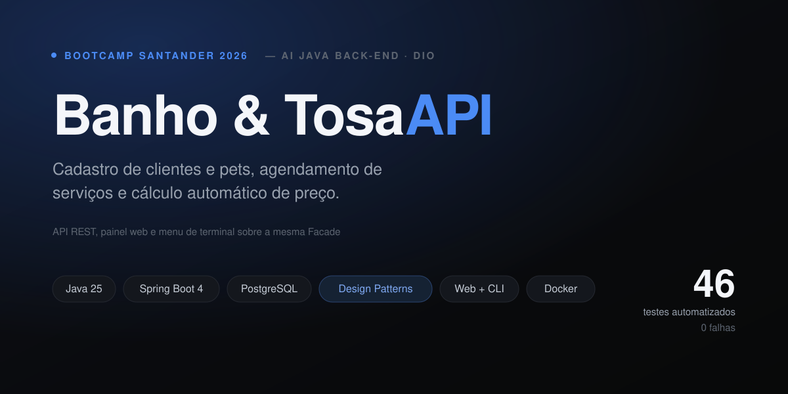
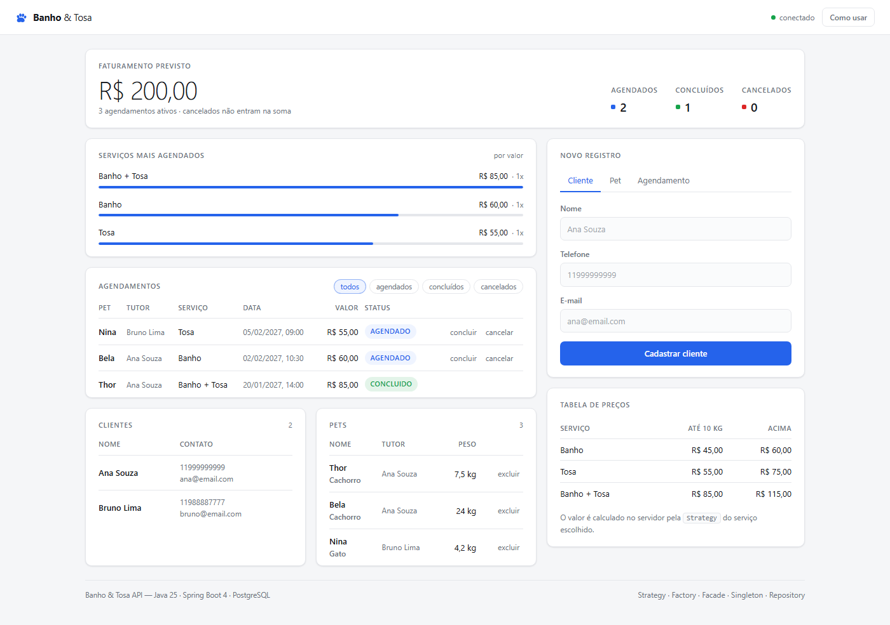
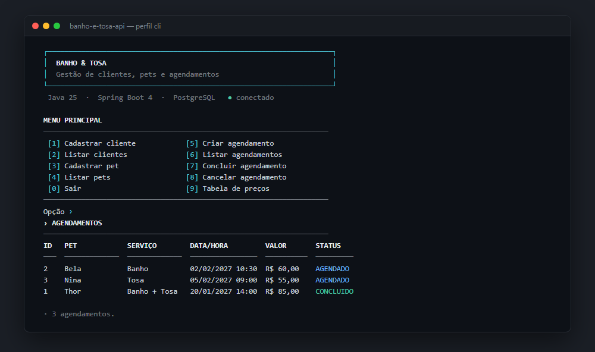

<div align="center">



<br>

[](https://openjdk.org/)
[](https://spring.io/projects/spring-boot)
[](https://www.postgresql.org/)
[](https://maven.apache.org/)
[](https://github.com/SheniaBatista/banho-e-tosa-api/actions/workflows/ci.yml)
[](LICENSE)

</div>

---

API REST para gestão de um pet shop: clientes, pets e agendamentos de banho e tosa.
O projeto foi desenvolvido como entrega prática do desafio de **Padrões de Projeto
(Design Patterns)** com Java e Spring.

Mais do que o CRUD, a proposta é deixar claro onde cada responsabilidade fica. O cálculo do
preço vive nas estratégias, a escolha da estratégia na fábrica, a coordenação do fluxo na
fachada e o acesso a dados nos repositórios. Para tornar essa separação visível, a mesma
regra de negócio é consumida por três interfaces diferentes: a API REST, um painel web e um
menu de terminal.

## Índice

- [Interfaces](#interfaces)
- [Padrões de projeto aplicados](#padrões-de-projeto-aplicados)
- [Arquitetura](#arquitetura)
- [Tecnologias](#tecnologias)
- [Como executar](#como-executar)
- [API REST](#api-rest)
- [Regras de negócio](#regras-de-negócio)
- [Tabela de preços](#tabela-de-preços)
- [Testes](#testes)
- [Estrutura do projeto](#estrutura-do-projeto)
- [Possíveis evoluções](#possíveis-evoluções)
- [Licença](#licença)

## Interfaces

As três interfaces chamam a mesma `AgendamentoFacade`. Nenhuma delas repete regra de negócio:
o preço, as validações e as transições de status são sempre decididos no servidor.

| Interface | Como abrir | Para quê |
|---|---|---|
| Painel web | `http://localhost:8080` | Uso diário: cadastrar, agendar, concluir e cancelar |
| Menu de terminal | perfil `cli` | Operar sem navegador, direto no console |
| API REST | `http://localhost:8080/clientes` | Integração com outros sistemas e testes via Postman |

### Painel web



O painel é servido pela própria aplicação, a partir de `src/main/resources/static`. São HTML,
CSS e JavaScript puros, sem build step e sem biblioteca externa. A tela mostra o faturamento
previsto, a distribuição por serviço, filtros por status e os formulários de cadastro.

O navegador não calcula preço. Ele apenas indica em qual faixa de peso o pet escolhido se
encaixa e exibe o valor que o servidor devolveu ao criar o agendamento.

### Menu de terminal



O menu sobe com o perfil `cli`, no lugar do servidor web, e aplica as mesmas restrições de
Bean Validation usadas na API. As cores são desligadas automaticamente quando a saída não é um
terminal, e a moldura cai para ASCII quando a página de código não consegue representar os
caracteres de desenho.

## Padrões de projeto aplicados

### Strategy

O preço varia conforme o serviço escolhido. Em vez de concentrar essa decisão em uma cadeia de
`if/else`, cada serviço tem a sua própria estratégia, todas implementando
`PrecoServicoStrategy`:

- `BanhoPrecoStrategy`
- `TosaPrecoStrategy`
- `BanhoETosaPrecoStrategy`

Para incluir um serviço novo basta criar uma classe. Nenhuma das existentes precisa ser
alterada.

### Factory

A `PrecoServicoFactory` recebe do Spring todas as implementações de `PrecoServicoStrategy` e
as indexa por `TipoServico` em um `EnumMap`. Quem pede o cálculo informa apenas o tipo de
serviço e recebe a estratégia correspondente.

Como o mapa é montado a partir da lista injetada, uma estratégia nova passa a ser reconhecida
assim que é anotada com `@Component`.

### Facade

A `AgendamentoFacade` é o ponto único de entrada nas regras de negócio. Ao criar um
agendamento, ela executa a sequência:

1. Busca o cliente.
2. Busca o pet.
3. Confere se o pet pertence àquele cliente.
4. Seleciona a estratégia de preço pela Factory.
5. Calcula o valor.
6. Persiste o agendamento.

É esse padrão que sustenta as três interfaces. Controllers REST e menu de terminal chamam os
mesmos métodos, sem duplicar uma linha de regra.

### Singleton no contexto do Spring

Componentes gerenciados pelo Spring usam escopo singleton por padrão. A `AgendamentoFacade` e
as estratégias têm uma única instância, criada e administrada pelo container de Inversão de
Controle.

O padrão não é implementado manualmente com construtor privado e método estático. O ciclo de
vida das instâncias fica sob responsabilidade do framework, que é a forma idiomática em Spring.

### Repository

`ClienteRepository`, `PetRepository` e `AgendamentoRepository` estendem `JpaRepository`.
Isso isola o acesso a dados e mantém as regras de negócio independentes de SQL.

## Arquitetura

```text
   Painel web            Menu de terminal          Postman / integrações
  (JS + fetch)              (ConsoleUI)                  (HTTP)
        │                        │                          │
        └────────► Controllers ◄─┼──────────────────────────┘
                        │        │
                        ▼        ▼
                   AgendamentoFacade
                   ┌──────┴───────────────┐
                   ▼                      ▼
              Repositories        PrecoServicoFactory
                   │                      │
                   ▼                      ▼
              PostgreSQL            PrecoServicoStrategy
```

Erros de negócio não vazam como stack trace. O `GlobalExceptionHandler` traduz
`RecursoNaoEncontradoException` em **404** e `RegraNegocioException` em **400**, sempre no
formato `ApiError`.

## Tecnologias

- **Java 25**
- **Spring Boot 4.1.0** com Web MVC, Data JPA e Bean Validation
- **PostgreSQL 16** para persistência
- **Hibernate** como ORM
- **Maven** para build, com wrapper incluído
- **JUnit 5, Mockito, AssertJ e Testcontainers** para os testes
- **Docker Compose** para o banco local

## Como executar

### Pré-requisitos

- JDK 25
- Docker para subir o PostgreSQL, ou um PostgreSQL 16 já instalado

Não é necessário ter o Maven instalado, porque o repositório inclui o wrapper (`./mvnw`).

### 1. Configurar as variáveis de ambiente

```bash
cp .env.example .env
```

O arquivo traz os valores padrão de desenvolvimento:

```properties
DB_HOST=localhost
DB_PORT=5432
DB_NAME=banho_e_tosa
DB_USERNAME=postgres
DB_PASSWORD=postgres
```

O `application.properties` usa esses nomes com valor padrão embutido, como em
`${DB_USERNAME:postgres}`. A aplicação sobe mesmo sem nada exportado no ambiente local, e
nenhuma credencial fica versionada no repositório.

### 2. Subir o PostgreSQL

```bash
docker compose up -d
```

O contêiner já cria o banco `banho_e_tosa`. Para usar uma instalação própria do PostgreSQL,
crie o banco manualmente e ajuste o `.env`:

```sql
CREATE DATABASE banho_e_tosa;
```

### 3. Rodar a aplicação

```bash
./mvnw spring-boot:run
```

No Windows:

```powershell
.\mvnw.cmd spring-boot:run
```

O Hibernate cria e atualiza as tabelas automaticamente, por causa de
`spring.jpa.hibernate.ddl-auto=update`.

O painel fica disponível em **<http://localhost:8080>**.

### 4. Rodar o menu de terminal

```bash
./mvnw -q clean package -DskipTests
java -jar target/banho-e-tosa-api-0.0.1-SNAPSHOT.jar --spring.profiles.active=cli
```

No Windows, para que os acentos apareçam corretamente, use o Windows Terminal ou execute
`chcp 65001` antes.

## API REST

Base: `http://localhost:8080`

### Clientes

| Método | Rota | Resposta |
|---|---|---|
| `POST` | `/clientes` | `201 Created` |
| `GET` | `/clientes` | `200 OK` |

```json
{
  "nome": "Ana Souza",
  "telefone": "11999999999",
  "email": "ana@email.com"
}
```

### Pets

| Método | Rota | Resposta |
|---|---|---|
| `POST` | `/pets` | `201 Created` |
| `GET` | `/pets` | `200 OK` |
| `DELETE` | `/pets/{id}` | `204 No Content` |

```json
{
  "nome": "Thor",
  "especie": "Cachorro",
  "raca": "Shih-tzu",
  "pesoKg": 7.5,
  "clienteId": 1
}
```

### Agendamentos

| Método | Rota | Resposta |
|---|---|---|
| `POST` | `/agendamentos` | `201 Created` |
| `GET` | `/agendamentos` | `200 OK` |
| `PATCH` | `/agendamentos/{id}/concluir` | `200 OK` |
| `PATCH` | `/agendamentos/{id}/cancelar` | `200 OK` |

```json
{
  "clienteId": 1,
  "petId": 1,
  "tipoServico": "BANHO_E_TOSA",
  "dataHora": "2027-01-20T14:00:00"
}
```

Tipos aceitos: `BANHO`, `TOSA` e `BANHO_E_TOSA`. O valor não é enviado na requisição, porque é
calculado pelo servidor.

### Formato de erro

```json
{
  "timestamp": "2027-01-15T10:30:00",
  "status": 400,
  "erro": "Bad Request",
  "mensagem": "O pet informado não pertence ao cliente selecionado."
}
```

### Postman

O diretório [`postman/`](postman/) traz uma collection pronta para importar, com testes de
resposta em cada requisição. O fluxo sugerido é:

```text
cadastrar cliente -> cadastrar pet -> criar agendamento -> listar -> concluir ou cancelar
```

## Regras de negócio

- O cliente deve ser cadastrado antes do pet.
- O pet deve estar associado a um cliente existente.
- Um serviço só pode ser agendado pelo tutor do pet.
- A data e hora do agendamento devem estar no futuro.
- O preço é calculado automaticamente conforme o serviço e o peso do pet.
- Um agendamento só pode ser concluído ou cancelado enquanto estiver `AGENDADO`.

## Tabela de preços

| Serviço | Pet até 10 kg | Pet acima de 10 kg |
|---|---:|---:|
| Banho | R$ 45,00 | R$ 60,00 |
| Tosa | R$ 55,00 | R$ 75,00 |
| Banho + Tosa | R$ 85,00 | R$ 115,00 |

A fronteira é inclusiva. Um pet de exatamente 10 kg paga a faixa menor, e esse comportamento
está coberto por teste.

## Testes

```bash
./mvnw test
```

São **46 testes**, distribuídos em quatro níveis:

| Nível | Classe | O que cobre |
|---|---|---|
| Unidade | `PrecoServicoStrategyTest` | A tabela de preços inteira, incluindo a fronteira de 10 kg |
| Unidade | `PrecoServicoFactoryTest` | Seleção da estratégia e recusa de tipo não registrado |
| Unidade | `AgendamentoFacadeTest` | Regras de negócio com os repositórios mockados |
| Web | `*ControllerTest` | Status HTTP, validação e tradução de erros, com `@WebMvcTest` |
| Integração | `BanhoETosaApiApplicationTests` | Fluxo completo contra um PostgreSQL real, com Testcontainers |

Os testes de integração sobem um PostgreSQL descartável em contêiner, então não dependem de
nenhum banco instalado. Quando não há Docker disponível, eles são ignorados em vez de falhar,
e o restante da suíte continua rodando.

## Estrutura do projeto

```text
src/main/java/com/portfolio/banhoetosa/
│
├── BanhoETosaApiApplication.java
│
├── cli/                         menu de terminal, perfil "cli"
│   ├── Console.java             entrada, saída e cores ANSI
│   └── ConsoleUI.java           menu e operações
│
├── controller/                  camada HTTP
│   ├── AgendamentoController.java
│   ├── ClienteController.java
│   └── PetController.java
│
├── dto/                         contratos de entrada
│   ├── AgendamentoRequest.java
│   └── PetRequest.java
│
├── exception/                   tratamento centralizado de erros
│   ├── ApiError.java
│   ├── GlobalExceptionHandler.java
│   ├── RecursoNaoEncontradoException.java
│   └── RegraNegocioException.java
│
├── facade/
│   └── AgendamentoFacade.java   ponto único das regras de negócio
│
├── model/                       entidades JPA e enums
│   ├── Agendamento.java
│   ├── Cliente.java
│   ├── Pet.java
│   ├── StatusAgendamento.java
│   └── TipoServico.java
│
├── repository/                  acesso a dados
│   ├── AgendamentoRepository.java
│   ├── ClienteRepository.java
│   └── PetRepository.java
│
└── strategy/                    cálculo de preço
    ├── PrecoServicoStrategy.java
    ├── BanhoPrecoStrategy.java
    ├── TosaPrecoStrategy.java
    ├── BanhoETosaPrecoStrategy.java
    └── PrecoServicoFactory.java

src/main/resources/
├── application.properties       configuração base, PostgreSQL
├── application-cli.properties   perfil do menu de terminal
└── static/                      painel web
    ├── index.html
    ├── css/styles.css
    └── js/app.js
```

## Possíveis evoluções

- Documentação interativa com Swagger/OpenAPI.
- Autenticação e autorização de usuários.
- Cadastro de funcionários e agenda por profissional.
- Controle de horários disponíveis, evitando conflito de agendamentos.
- Migrations de banco com Flyway, no lugar do `ddl-auto=update`.
- Paginação e filtros nas listagens.

## Licença

Distribuído sob a licença [MIT](LICENSE).

## Autoria

Projeto desenvolvido por **Shênia Batista** para fins educacionais e de portfólio, como
entrega prática do desafio de Padrões de Projeto com Java e Spring, do Bootcamp Santander 2026
na trilha AI Java Back-end (DIO).
